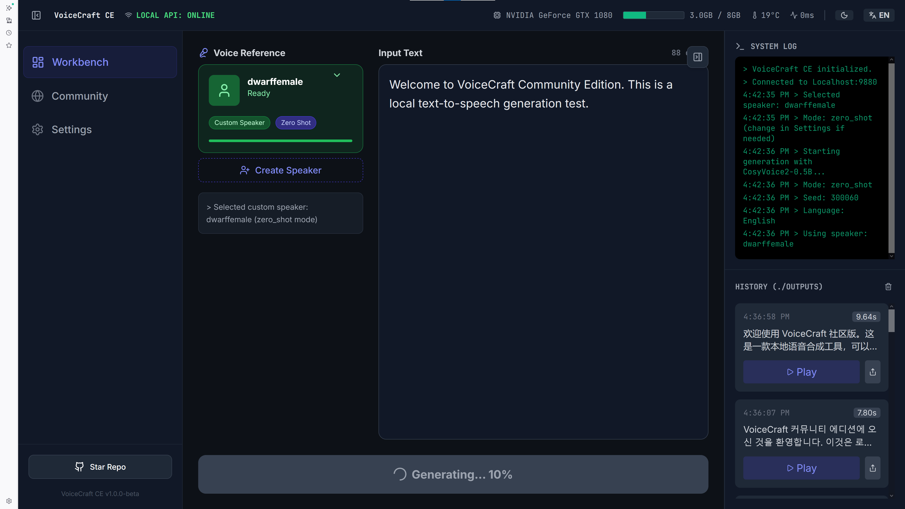
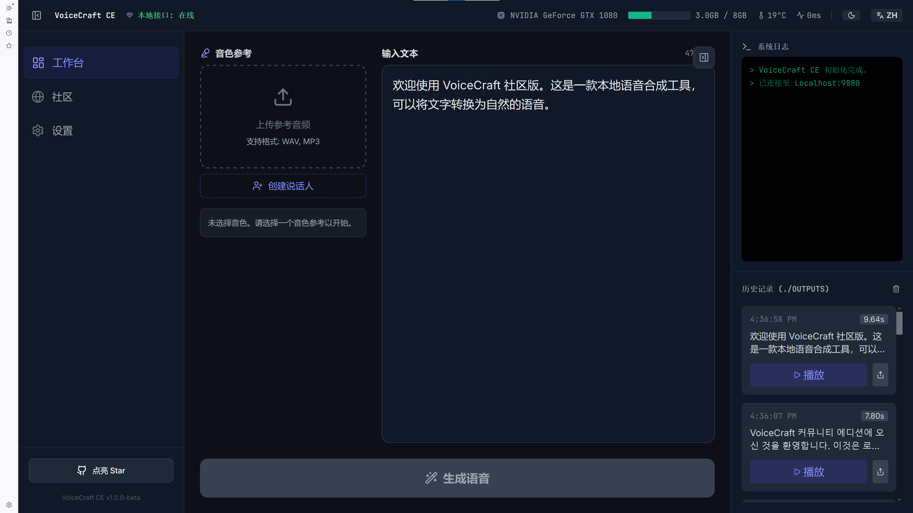
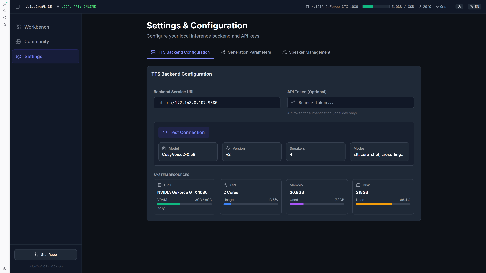
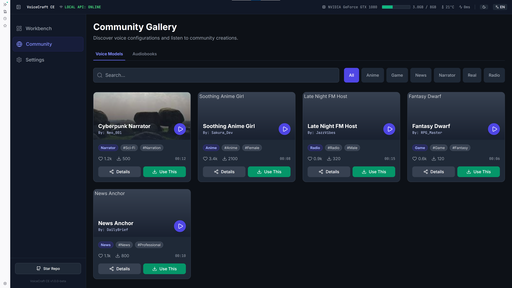

<div align="center">

# VoiceCraft Community Edition

A local text-to-speech (TTS) application powered by CosyVoice 2.0, featuring preset voices, custom speaker management, and multilingual synthesis.



</div>

## Features

### 🎙️ Voice Synthesis
- **Zero-Shot Voice Cloning**: Clone any voice with just a reference audio sample
- **Cross-Lingual Synthesis**: Synthesize speech in different languages
- **Instruct2 Mode**: Control emotion and speaking style with instructions

### 🌐 Multilingual Support
- **Primary Languages** (Best Quality):
  - Chinese (130,000 hours training data)
  - English (30,000 hours training data)
- **Cross-Lingual** (Good Quality):
  - Japanese
  - Korean

### 🎨 Preset Voices


- Pre-configured voices ready to use
- Customizable audio and prompt text
- Export/import voice configurations

### 👥 Speaker Management


- Create custom speakers with reference audio
- Persistent storage using IndexedDB
- Export and backup your speakers

### 📚 Community Gallery


- Discover community-created voices
- Share your own voice configurations

## Getting Started

### Prerequisites

- **Node.js** 18+ 
- **CosyVoice 2.0 Backend** running on `http://localhost:9880`

### Installation

```bash
# Clone the repository
git clone https://github.com/youyouhe/VoiceHub.git
cd VoiceHub

# Install dependencies
npm install

# Start development server
npm run dev
```

### Backend Setup

VoiceCraft requires a local CosyVoice 2.0 backend. Refer to the [CosyVoice repository](https://github.com/FunAudioLLM/CosyVoice) for setup instructions.

Default backend URL: `http://localhost:9880`

## Usage

### 1. Select or Configure a Voice

**Option A: Use Preset Voice**
1. Go to Workbench
2. Select a preset voice from the dropdown
3. Click the gear icon to configure audio and prompt text

**Option B: Use Custom Speaker**
1. Go to Settings → Speakers
2. Create a new speaker with reference audio
3. Select the speaker in Workbench

### 2. Enter Text


Demo text automatically adjusts based on selected language.

### 3. Generate

Click "Generate Speech" to synthesize audio.

### 4. Export

Generated audio is saved in History panel. Export or publish to community.

## Project Structure

```
VoiceHub/
├── public/                 # Static assets
├── src/
│   ├── components/         # React components
│   │   ├── Workspace.tsx   # Main workbench
│   │   ├── Settings.tsx    # Settings & speaker management
│   │   └── SpeakerManagement.tsx
│   ├── hooks/              # Custom React hooks
│   ├── services/           # API services
│   ├── utils/              # Utility functions
│   │   ├── storage.ts      # IndexedDB storage
│   │   └── presetImportExport.ts
│   └── i18n/               # Internationalization
├── preset-voices/          # Preset voice documentation
└── constants.ts            # Constants and language configs
```

## API

VoiceCraft communicates with CosyVoice 2.0 backend via REST API.

| Endpoint | Method | Description |
|----------|--------|-------------|
| `/health` | GET | Health check |
| `/speakers` | GET/POST | List/create speakers |
| `/tts` | POST | Text-to-speech |

See [API.md](API.md) for detailed documentation.

## Technologies

- **Frontend**: React 19, TypeScript, Vite
- **Styling**: Tailwind CSS
- **Storage**: IndexedDB (larger capacity than localStorage)
- **Backend**: CosyVoice 2.0

## License

MIT License - see LICENSE file for details.

## Acknowledgments

- [CosyVoice](https://github.com/FunAudioLLM/CosyVoice) - The TTS engine powering this application

## Roadmap

### Phase 1: Community Token System
- Design and implement VC token economics (1B total supply)
- Provider Node service for distributed TTS workload
- Consumer/Validator role system
- Token mining and task pricing mechanism

### Phase 2: Reputation System
- Provider reputation scoring
- Quality validation for synthesized audio
- Dispute resolution mechanism

### Phase 3: Advanced Features
- Batch processing for large text inputs
- Voice customization presets sharing
- Community voting for voice quality

## Contributing

Contributions are welcome! Please read our contributing guidelines before submitting PRs.
